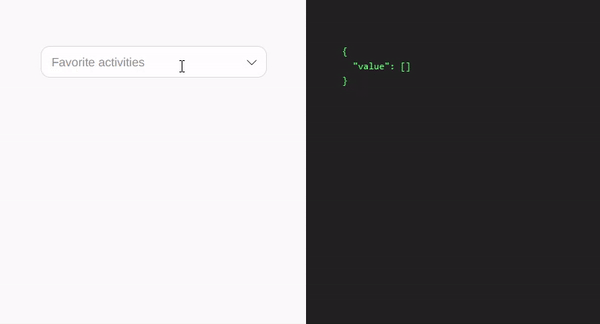

# Cute Multi Select

## Purpose

This is a basic project to demonstrate how you can quickly create a reusable select box component in React+TypeScript without any external dependencies!

## Live Demo

You can see the demo, hosted on GitHub Pages by following the [Demo Link here](https://ptvty.github.io/cute-multi-select).

You can also check the component in isolation [Here in Storybook](https://ptvty.github.io/cute-multi-select/storybook-static).

## Tech Stack

 - React
 - TypeScript
 - SCSS
 - Vite
 - Vitest
 - Storybook
 
## Running Dev Server

    npm run dev

## Running Tests

For the purpose of this small project,Vitest Browser Mode is used, which is an experimental project.

Run `npm test` to run tests, and `npm run coverage` for test coverage.

    ---------------------|---------|----------|---------|---------|
    File                 | % Stmts | % Branch | % Funcs | % Lines |
    ---------------------|---------|----------|---------|---------|
    All files            |   99.32 |    87.09 |     100 |   99.32 |
    component            |   99.06 |    87.03 |     100 |   99.06 |
      Option.tsx         |     100 |      100 |     100 |     100 |
      Select.tsx         |   98.88 |    85.71 |     100 |   98.88 |
      types.ts           |       0 |        0 |       0 |       0 |
    hooks                |     100 |    83.33 |     100 |     100 |
      useClickOutside.ts |     100 |    83.33 |     100 |     100 |
    icons                |     100 |      100 |     100 |     100 |
      check2.tsx         |     100 |      100 |     100 |     100 |
      chevron-down.tsx   |     100 |      100 |     100 |     100 |
    ---------------------|---------|----------|---------|---------|

## Roadmap

This project is obviously not ready for production, as it is out of the scope of this project. The most important drawbacks are:

- Accessibility issues
  - Browsing and selecting options are only possible via a pointing device, users should be able to use keyboard (Up/Down arrow keys) to use the component.
  - It might not be screen-reader friendly, ARIA attributes are not used.

- Functional issues
  - The input that allows adding new options works only when no options are selected.
  - The popover size is fixed, while it should be calculated based on view port space.
  - The popover position should be calculated based on the viewport size, element position on the screen. Libraries exist that can help with this
  - The component has limited props and thus not very customizable. For example converting it to a single-option select, adding validation rules like max/min selectable options, tameable look and feel are some ideas that can make the component fit in more use cases.